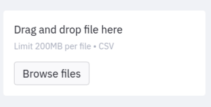
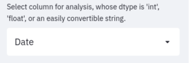
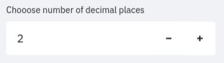
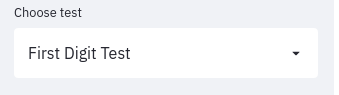
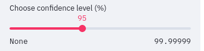
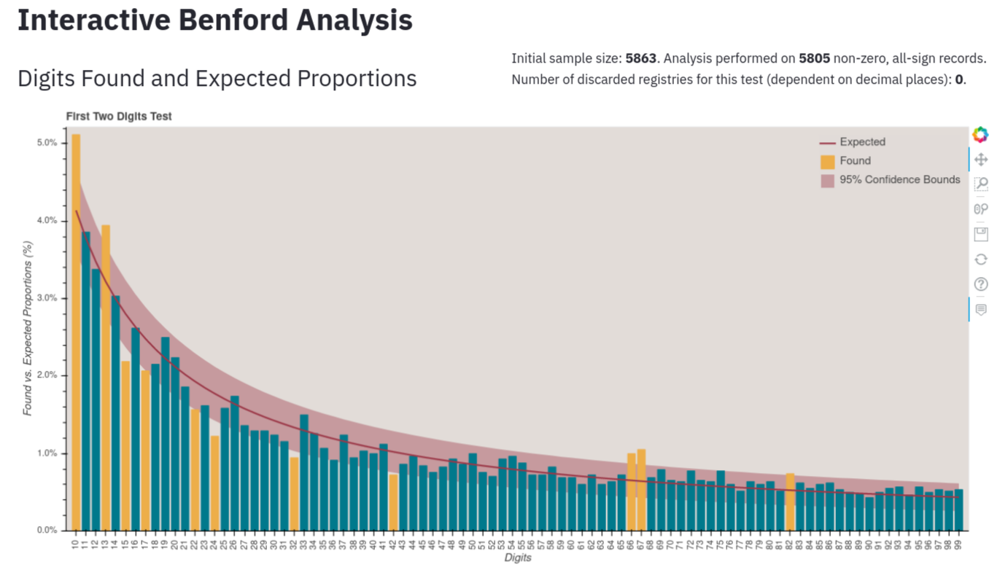
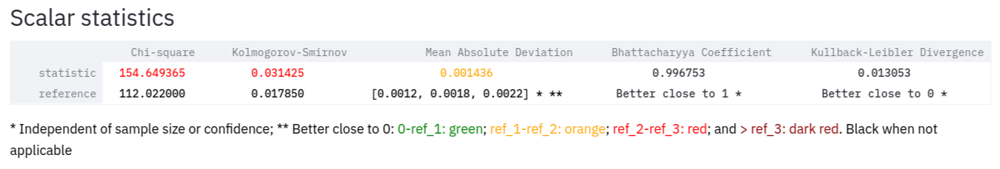
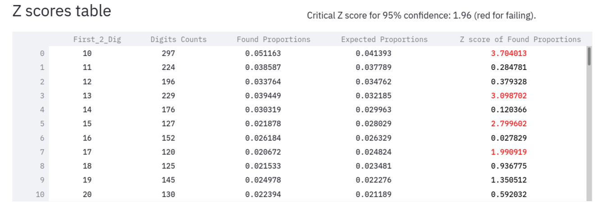
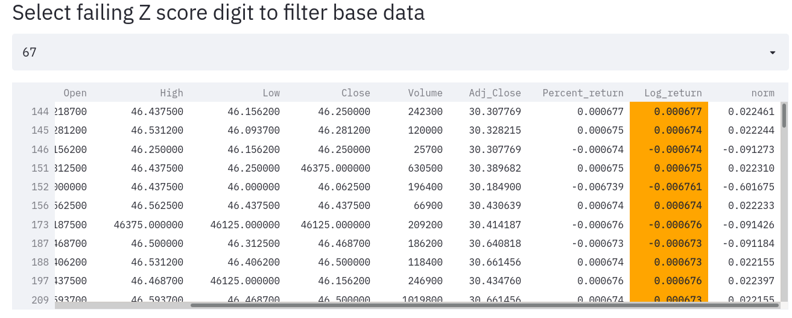

# benford-streamlit

## Interactive Benford Analysis App

This project brings [`benford_py`](https://github.com/milcent/benford_py),  [`benfordviz`](https://github.com/milcent/benfordviz), and [`streamlit`](https://streamlit.io/) together in an interactive Benford Analysis.

### Citing

If you find *`benford-streamlit`* useful in your research, please consider adding the following citation:

```bibtex
@misc{benford-streamlit,
      author = {Marcel, Milcent},
      title = {{benford-streamlit: an Interactive Benford Analysis App}},
      year = {2021},
      publisher = {GitHub},
      journal = {GitHub repository},
      howpublished = {\url{https://github.com/milcent/benford-streamlit}},
}
```

## Version 0.1.0

### Python versions and dependencies

This implementation has been tested in python versions `3.7.9` and `3.8.10`, and with `streamlit` versions `0.68` and `0.82`. The most important configuration is letting `bokeh` in version `2.2.2` (not the most recent), as the charts for some reason do not show with `2.3.2`. Setting up the environment with the`requirements.txt` file should work fine.

## Installation

Clone the repo and go into the recently created `benford-streamlit` folder:

```bash
git clone https://github.com/milcent/benford-streamlit.git
cd benford-streamlit
```

### `venv` and `pip`

Create a virtual environment for the repo:

```bash
python -m venv venv
```

Acivate the environment

- On windows:

```powershell
./venv/Scripts/activate
```

- On Linux / Mac:

```bash
source venv/bin/activate
```

Update pip and install the dependencies:

```bash
python -m pip install --upgrade pip
python -m pip install -r requirements.txt
```

### `conda`

If you use conda, setting up an environment with it has also worked:

```bash
conda env create -n benford-streamlit
conda activate benford-streamlit
conda install pandas bokeh=2.2.2
```

But `streamlit`, `benford_py`, and `benfordviz` must be installed with `pip` anyway, so you will have to use it in this last part:

```bash
pip install streamlit benford_py benfordviz
```

### Launching the interactive analysis through `streamlit` after setup

```bash
streamlit run benford-analysis.py
```

A message lik the one bellow will appear:

```bash
You can now view your Streamlit app in your browser.

Local URL: http://localhost:8501
Network URL: http://255.168.1.2:8501
```

If your browser does not open automatically, open it and go to [http://localhost:8501](http://localhost:8501).

### `Docker`

I have also created a `Docker` container with the interactive app in it ready to go [here](https://hub.docker.com/repository/docker/milcentm/benford-streamlit), so if you have docker installed, type:

```bash
docker run --rm -p 8506:8501 milcentm/benford-streamlit
```

## Analysis

### Sidebar

The first option is the file selector, with which you choose the file to upload. As of now, it supports only `.csv` files, and make sure yours really uses commas (`,`) as separators and is encoded in `utf-8`. I have tried to insert some `pandas` extra loading options (`sep`, `encoding`, `decimal`, `thousands`), but ran into a lot of trouble and the sidebar got poluted. Maybe later or with some PR.



Next up, select the column you want to analyse. You can change it at any time. Just remember to choose a numeric column. `benford_py`, and `pandas` for that matter, will try to convert numeric columns loaded as strings, but it is not guaranteed.



While you do not choose a column with the right `dtype`, the message below will be on.


Then, you must choose the sign of the records you want to analyse. Under the hood, `benford_py` will turn all numbers to their absolute values, but you may want to run your analyses only on the positive or negative records (defaults to all).


A message similar to the one below will show on the top right side if your data has negative numbers and you choose only the positive ones.


The next selector is the decimal places one. `benford_py` lets you tune this paramenter based on the type of data you have. The default is `2`, for currencies, but you may need to decrease it down to `0`, when dealing with integers, or increase it, when analysing really small numbers, with lots of decimal places, such as log-returns of a stock.



If you know your data, though, this parameter should be set once and forgotten. Having sad that, dependent on the Benford Test you choose to apply to the dataset, you will be informed how many, if any, records were discarded from the analysed sample due to your decimal places choice.


Getting closer now! You will choose the Benford Test to apply in the next dropdown.



The analysis covers the:

- First Digit Test;
- Second Digit Test;
- First Two Digits Test;
- First Three Digits Test; and
- Last Two Digits Test.

The final selector in the sidebar is the `confidence` level one. Some of the statistics computed in the tests (Chi-square, Kolmogorov-Smirnov, Z scores) need a confidence level set, so there can be critical values to compare the findings with.



### Central panel

The main analysis area starts with some basic info about the sample and the respective test plot. See the example of a First Two Digits test bellow.



According to the confidence level chosen, `banfordviz` draws upper and lower bounds, and the bars whose values lay outside them get colored in yellow. The plot has all `bokeh` interactive features, like tooltips, zooming, panning, and hiding an especific element by clicking on its legend.

The next section displays the results of the scalar (single value) statistics. I do not presume to tell you which is best, so the choice is all yours.



The first row brings the statistis, and the second, their respective reference values, when applicable. Some are dependent on sample size and confidence level, like the Chi-square and the Kolmogorov-Smirnov. The others are not. I know, I know, the Kolmogorov-Smirnov is not that appropriate for comparing discrete distributions, but it is implemented in `benford_py`, so it is here.

Then comes the Z scores table, which correlates with the test plot analysis, since failing in this test, i.e., showing a Z score higher than the critical value set by the confidence level, means falling outside the plot's confidence bounds.
It also shows the counts and the found and expected proportions for every digit.



A note in the upper right remenbers the confidence level and its respective Z critical value, and values higher than this are colored in red.

In the following section, you will be able to select one of the failing digits from the Z score table to filter your original data. This has been shown invaluable when auditing other columns of the data (even non-numerical ones) for other important information. The selected column is highlighted for reference.



That's it. I hope you like it!